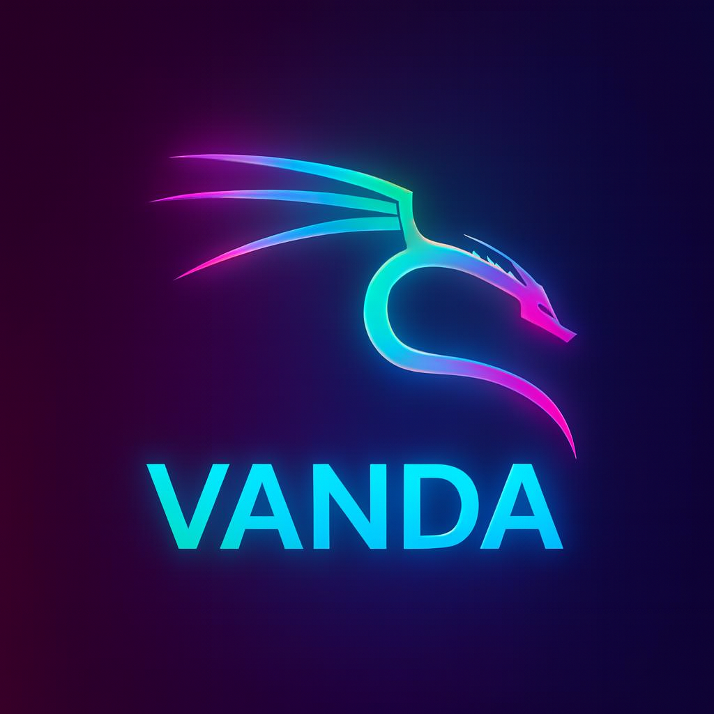

<div align="center">
  
  <h1>🐧 VANDA Userbot</h1>
  <p><strong>Modern, modular and secure Telegram userbot</strong></p>
  <p>
      
    <a href="#">
      
    </a>
    <a href="#">
      
    </a>
    <a href="LICENSE">
      
    </a>
    <a href="#">
      
    </a>
    <a href="#">
      
    </a>
    <a href="#">
      
    </a>
    <a href="https://github.com/psf/black">
      
    </a>
  </p>
</div>

## ⚠️ Disclaimer

> VANDA is a powerful tool. With great power comes great responsibility.  
> The developer is **not responsible** for any consequences of using this software.  
> Use at your own risk. Always verify modules from untrusted sources.

## ✨ Features

| | |
|---|---|
| 🚀 **Latest Telegram layer** | Reactions, video stickers, and more |
| 🔒 **Advanced security** | Entity caching, targeted rules, flood protection |
| 🎨 **Modern UI/UX** | Beautiful interfaces and smooth interactions |
| 📦 **Modular system** | Easy to extend with custom modules |
| 🔄 **Backward compatible** | Works with FTG and GeekTG modules |
| 🎯 **Inline features** | Forms, galleries, lists, and more |

## 📦 Installation

### Quick install Termux 
```bash
termux-wake-lock
export AIOHTTP_NO_EXTENSIONS=1

pkg update -y
pkg upgrade -y
pkg install tur-repo -y
pkg install python3.10 git wget ncurses-utils openssl -y

git clone https://github.com/Alia-Ether/VANDA
cd VANDA

pip3.10 install -r requirements.txt
python3.10 -m hikka
```

Quick install Ubuntu

```bash
apt update && apt install git python3 -y
git clone https://github.com/Alia-Ether/VANDA
cd VANDA
pip install -r requirements.txt
python3 -m hikka
```

<details>
<summary>📸 Installation preview</summary>


</details>

📋 Requirements

· Python 3.9 - 3.12
· API ID & Hash from my.telegram.org

📚 Documentation

· User Guide
· Developer Docs

🆘 Support

<div align="center">
  <a href="https://t.me/NEBULASoftware">
    
  </a>
  <br>
  <sub>Join our channel for updates and support</sub>
</div>

📄 License

This project is licensed under the GNU AGPLv3 License - see the LICENSE file for details.

<div align="center">
  <sub>Made with 🐧 by Alia Ether</sub>
</div>